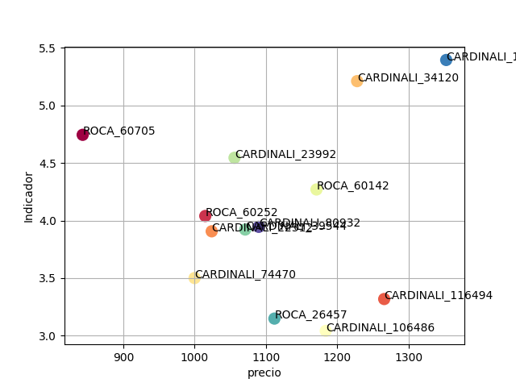
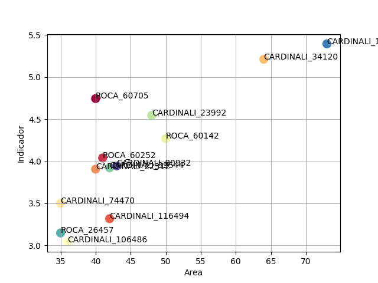

# choosing-apartment
Are you undecided to choose an apartment? Use this jupyter notebook to take a desicion. First, first fill the data in the table regarding the price, area, labels, etc. The indicator I is defined as I = Area/price. The higher the I value, the greater the area and the lower the rent value. You choose the best option by:
- By plotting I vs price: best options are in left lower quadrant
- By plotting I vs area: best options are in right upper quadrant

# Some useful plots
Making tables for choosing best apartment based on price and area, pandas table.
From Jupyter notebook plot.pynb

